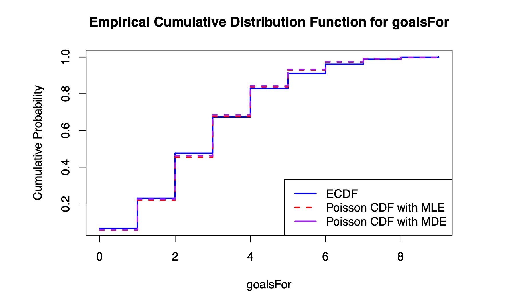
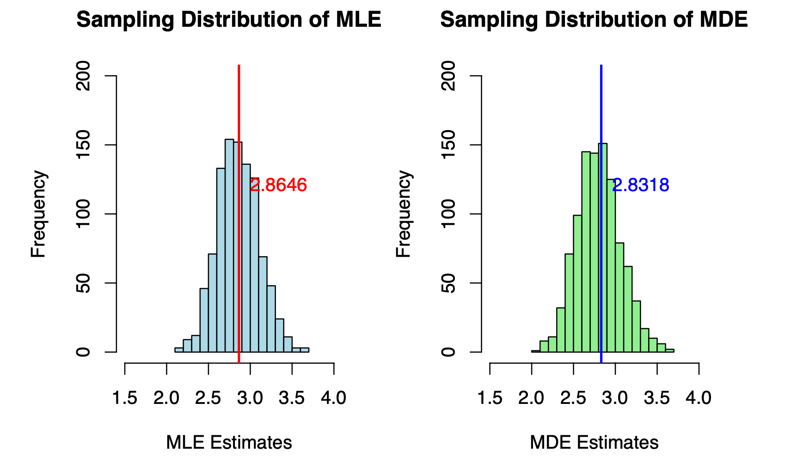
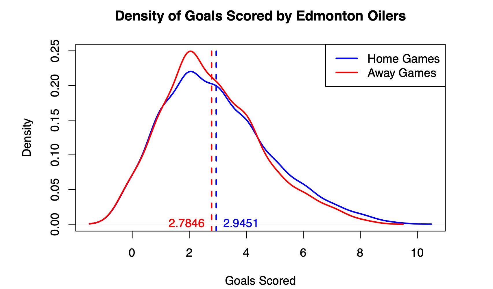
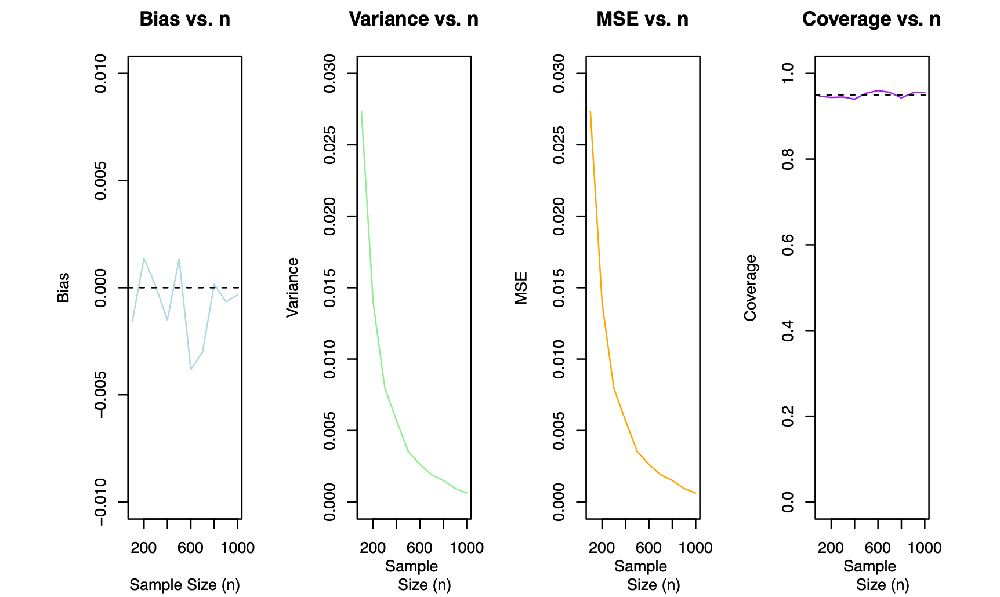

# Edmonton_Oilers_Analysis
Statistical Analysis on the Edmonton Oilers
# Edmonton Oilers Goals Analysis: A Statistical Exploration

## Project Overview
This project delves into game data for the Edmonton Oilers from the 2008-2024 NHL seasons to explore goal-scoring patterns and the possible influence of "home ice advantage." Using statistical techniques like Maximum Likelihood Estimation (MLE), Minimum Distance Estimation (MDE), and the Horvitz-Thompson (HT) estimator, this analysis sheds light on goal distributions, the accuracy of estimations, and the effects of playing at home versus away.

---

## Analysis Report
[View the full analysis report](report/edm_oilers_analysis_report.pdf)

---

## Table of Contents
1. [Data Overview](#data-overview)
2. [Poisson Model Analysis](#poisson-model-analysis)
3. [Sampling Distributions for MLE and MDE](#sampling-distributions-for-mle-and-mde)
4. [Horvitz-Thompson Estimation for Home vs. Away Games](#horvitz-thompson-estimation-for-home-vs-away-games)
5. [Bias, Variance, and MSE Analysis for Horvitz-Thompson Estimator](#bias-variance-and-mse-analysis-for-horvitz-thompson-estimator)
6. [Key Insights and Conclusions](#key-insights-and-conclusions)

---

## Data Overview
The datasets utilized in this project include:
- **EDM.csv**: A dataset of Edmonton Oilers games from 2008-2024, recording goals scored per game and game-level variables.
- **gamesWatched.csv**: A list of 100 games watched by a user, used for Horvitz-Thompson estimation.

| **Variable**       | **Description**                                                                 |
|--------------------|---------------------------------------------------------------------------------|
| **gameDate**       | Date of the game in `YYYYMMDD` format                                           |
| **goalsFor**       | Goals scored by the Edmonton Oilers in each game                                |
| **home_or_away**   | Indicates if the game was a `HOME` or `AWAY` game                               |
| **situation**      | Describes the game situation: `all` for all situations in this analysis         |
| **season**         | Starting year of the NHL season (e.g., `2018` for the 2018-19 season)           |

---

## Poisson Model Analysis
### Objective
To model the distribution of goals scored by the Edmonton Oilers using a Poisson distribution and evaluate the fit using two estimation techniques.

### Methodology
1. **Empirical Cumulative Distribution Function (ECDF)**: Calculated to represent the actual goal distribution.
2. **Poisson Cumulative Distribution Function (CDF)**: Derived using:
   - **Maximum Likelihood Estimation (MLE)**: Provides parameter estimates by maximizing the likelihood function.
   - **Minimum Distance Estimation (MDE)**: Estimates parameters by minimizing the distance between the observed ECDF and Poisson CDF.

### Visualization
- The plot overlays the ECDF with the Poisson CDFs generated using MLE and MDE. The alignment of MLE with the ECDF suggests a more accurate fit.
  

### Analysis
- **MLE vs. MDE**: MLE closely matches the ECDF, indicating that it better captures the underlying distribution of goals than MDE.

---

## Sampling Distributions for MLE and MDE
### Objective
To understand the variability of MLE and MDE estimators for the goal data.

### Methodology
1. Created 1000 samples of size 50 from the dataset.
2. Calculated MLE and MDE for each sample and plotted the distributions.

### Visualization
- The histograms below display the sampling distributions for MLE and MDE, with a vertical line indicating the true population parameter.
  

### Findings
- **MLE** shows less variability and bias compared to MDE, confirming it as the more reliable estimator for this dataset.

---

## Horvitz-Thompson Estimation for Home vs. Away Games
### Objective
To evaluate if Edmonton Oilers score more goals at home, suggesting a possible home ice advantage.

### Methodology
- Used the **Horvitz-Thompson estimator** to estimate average goals scored at home versus away games based on observed data.
- Computed standard errors and a confidence interval for the difference between home and away goals.

### Visualization
- Density plots of goals scored at home versus away, with mean lines indicating a higher goal average for home games.
  

### Findings
- The analysis suggests a higher average goal count at home (2.95) than away (2.78). However, a 95% confidence interval around this difference includes zero (-0.17, 1.79), indicating this difference may not be statistically significant.

---

## Bias, Variance, and MSE Analysis for Horvitz-Thompson Estimator
### Objective
To evaluate how sample size affects the reliability of the Horvitz-Thompson estimator for goal averages.

### Methodology
- Conducted simulations with sample sizes ranging from 100 to 1000 and computed bias, variance, MSE, and coverage probability.
- Generated 1000 samples for each sample size and calculated the Horvitz-Thompson estimator, capturing the metrics in line plots.

### Visualization
- Line plots showing bias, variance, MSE, and coverage for the Horvitz-Thompson estimator at different sample sizes.
  

### Analysis
- As sample size increases:
  - **Bias** decreases, approaching zero.
  - **Variance** and **MSE** also decrease, improving estimator reliability.
  - **Coverage** stabilizes near 95%, supporting estimator accuracy.

---

## Key Insights and Conclusions
### Summary of Findings
- **Poisson Model for Goals**: The Poisson model, specifically MLE, effectively models the goals scored by the Edmonton Oilers, with MLE outperforming MDE in accuracy.
- **Home Ice Advantage**: Although home games show a slightly higher goal average, this difference is not statistically significant, leaving the home advantage hypothesis inconclusive.
- **Horvitz-Thompson Estimator**: Increasing the sample size improves estimator accuracy, as seen in reduced bias, variance, and MSE, with reliable confidence intervals.

### So What?
Understanding the goal patterns of the Edmonton Oilers offers more than statistical exercise:
- **Performance Analytics**: Insights into goal distributions can aid coaching decisions, player development, and game strategies.
- **Home Advantage Exploration**: Despite inconclusive statistical evidence, this analysis opens the door to further investigations into venue effects, which are of high interest in sports performance analysis.
- **Sampling Precision**: The Horvitz-Thompson estimator's performance across sample sizes highlights the importance of adequate sample size in sports and survey analytics, ensuring precision and confidence in conclusions.

### Techniques Used
- **MLE and MDE for Poisson Estimation**: Both estimators applied to model goal data and assess distribution fit.
- **Horvitz-Thompson Estimator**: Used for estimating average goals in home versus away games.
- **Bias, Variance, MSE Analysis**: Evaluated estimator performance across sample sizes.

---

## How to Run the Project
To reproduce this analysis:
1. Clone the repository.
2. Run each script in the `/scripts` folder in sequence or open the analysis report in RStudio.

---

This analysis provides a comprehensive look at the Edmonton Oilers’ scoring data, showcasing statistical methods’ impact on understanding sports data. Future analysis could incorporate a broader dataset, additional situational factors, or comparison across seasons.